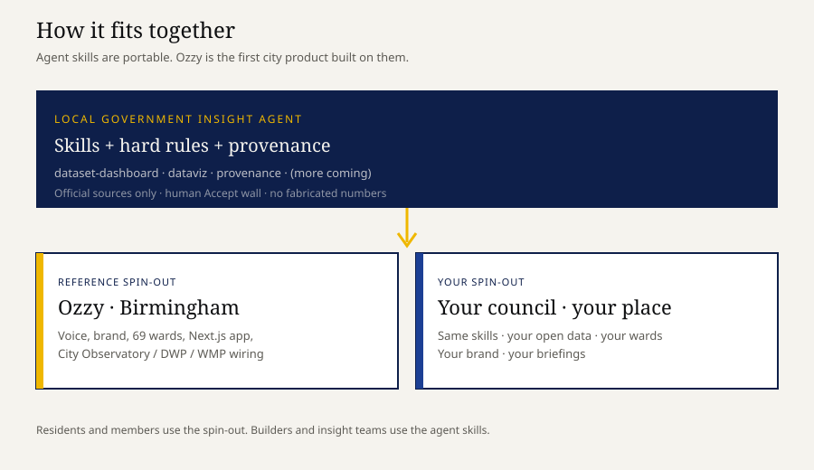
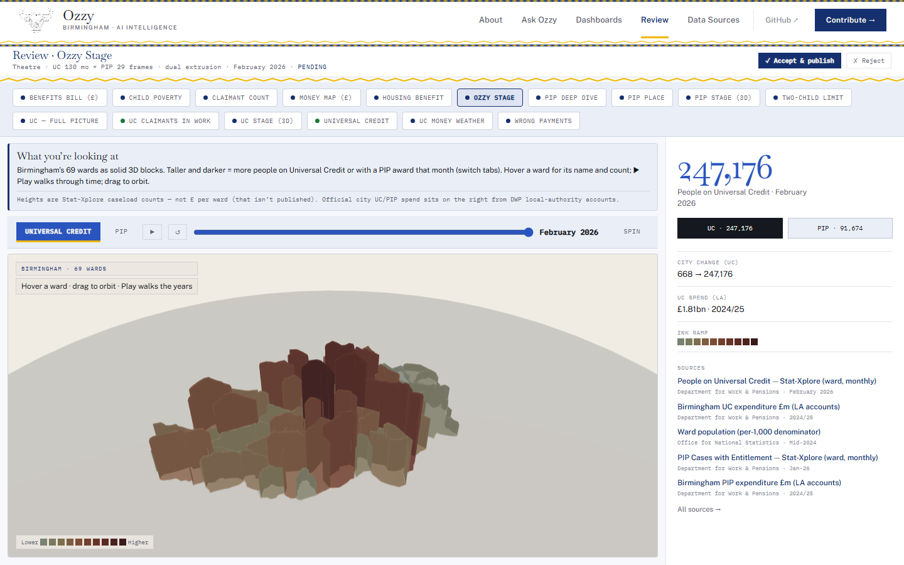
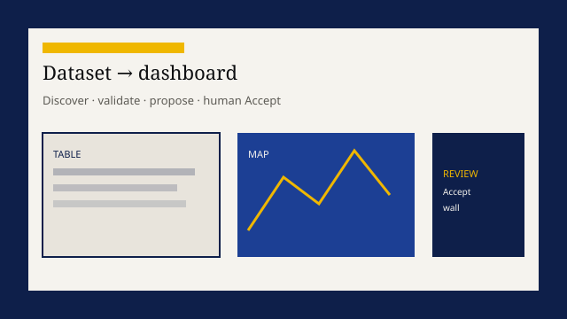
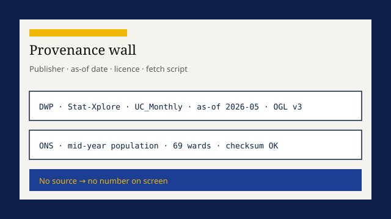
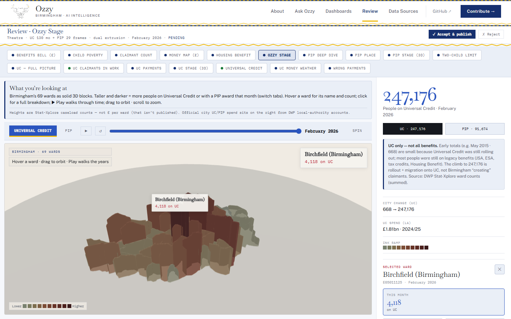
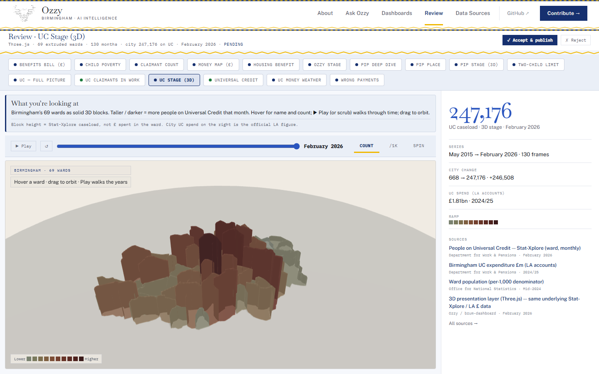

# Ozzy — Civic Intelligence Prototype

**New to GitHub, Node.js or localhost? Start with the [For N00bs guide](docs/for-n00b.md).**

**Visualise selected public data. See patterns. Explore what they might mean.**

**Ozzy** is an independent, open-source civic intelligence prototype for Birmingham. It demonstrates how selected public datasets can become visualisations, comparisons and starting points for asking “so what?” — what is happening, why might it matter, and what evidence would help explain it?

Today’s prototype has limited data coverage. Its charts and supporting analysis help people explore questions; they do not establish causes. Broader database integration, easier adaptation to other councils and an agentic investigation loop are development ambitions.

The repository also contains reusable playbooks for people building with AI. These support the prototype; they do not mean an autonomous analyst is operating inside it.

<p align="center">
  
</p>

| You are… | You use… | You get… |
|----------|----------|----------|
| Insight / intelligence team | Skills + optional app | Evidence packs, peer charts, briefings |
| Builder (incl. with AI) | Skills in this repo | Playbooks to test and adapt to local sources |
| Resident / journalist | [Ozzy](#ozzy) | Visualisations and questions grounded in selected public data |

---

## How it works

```
Official data  →  validate  →  proposal  →  human Accept  →  live views
                      ↓
              ask why · research · evidence report
```

1. **Agent skills** teach a coding agent the jobs of a local insight analyst.  
2. **Ozzy** is the prototype that shows selected data and supporting analysis.
3. **Hard rule:** no invented numbers. Missing stays missing. Provenance on every metric.

<p align="center">
  
</p>

---

## Skills

Point Claude / Codex / Grok / etc. at `skills/`. Designed for reuse across places. Adapting the geography, sources and definitions still requires checking; automatic council setup is not established.

| Skill | Job |
|-------|-----|
| **[dataset-dashboard](skills/dataset-dashboard/SKILL.md)** | Discover official data → validate → proposal → human Accept → dashboard |
| **[dataviz](skills/dataviz/SKILL.md)** | Right chart for the data’s job; honest gaps & geography |
| **[provenance](skills/provenance/SKILL.md)** | Publisher, as-of, licence, script — no source → no UI |
| **[insight-analysis](skills/insight-analysis/SKILL.md)** | What the data says · why-questions · research · evidence report |

<p align="center">
  
  
  
</p>

**Coming:** place-config · money-story · briefing/newsletter · agentic chat  

---

## Ozzy

Birmingham prototype — selected dashboards, maps, a review workflow and supporting “why” analysis. Coverage and geography depend on the dataset; consult its source and limitations.

```bash
npm install
npm run dev
```

→ http://localhost:3000 · `/dashboard` · `/review` · `/sources`

<p align="center">
  
  
</p>

---

## Explore adapting it for another council

1. Clone this repo / load `skills/`.  
2. Point your coding agent at **your** open data catalogue and geography codes.
3. Run **dataset-dashboard** → **dataviz** → **provenance**.  
4. Use **insight-analysis** when someone asks *why* (outliers, peers, briefing).  
5. Adapt the local prototype; retain human review and source tracking.

Start with one dataset and verify the result against its source. Reuse across councils is a development direction, not a proven one-step setup.

Details: [docs/for-councils.md](docs/for-councils.md) · [docs/for-builders.md](docs/for-builders.md) · [docs/architecture.md](docs/architecture.md)

---

## Hard rules

- Official sources only · never fabricate · missing → `—`  
- Derived values labelled · human Accept before live data  
- No API keys in the browser  

Full agent rules: [AGENTS.md](AGENTS.md)

---

## Repo map

| Path | Role |
|------|------|
| `skills/` | **Reusable development and analysis playbooks** |
| `app/` | Ozzy (Birmingham UI) |
| `proposals/` → `/review` | Accept wall |
| `lib/sources.ts` | Provenance registry |
| `assets/` | README demos |

---

## Contribute

Email [westmidlands@lookingforgrowth.uk](mailto:westmidlands@lookingforgrowth.uk) · [GitHub](https://github.com/willspensley/brum-dashboard-)

Repo path remains `brum-dashboard-`; project name: **Ozzy** · descriptor: **civic intelligence prototype**.

<p align="center"><em>Selected public data. Clear visualisations. Better questions about Birmingham.</em></p>
